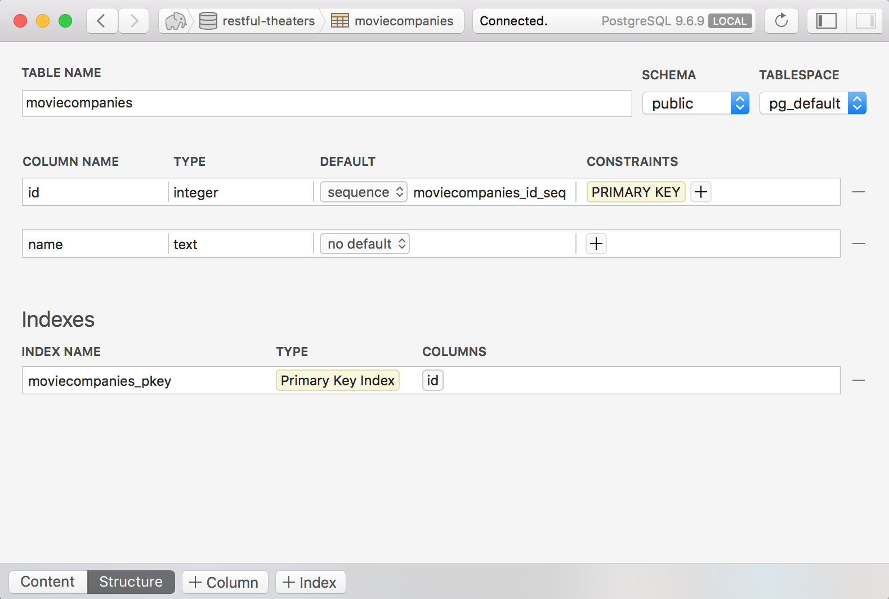
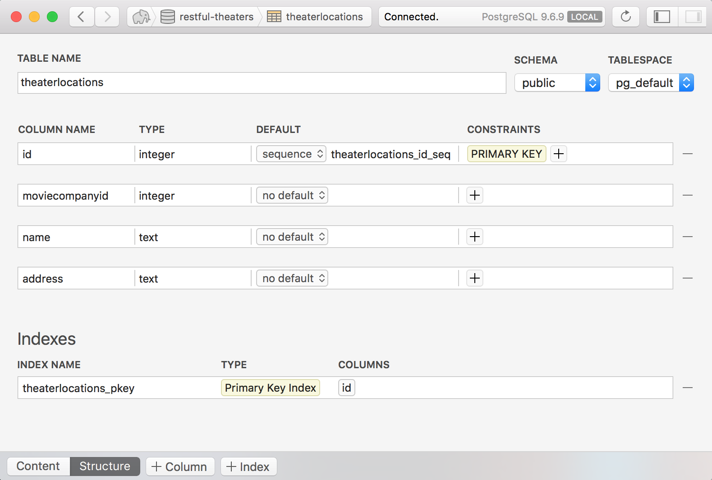
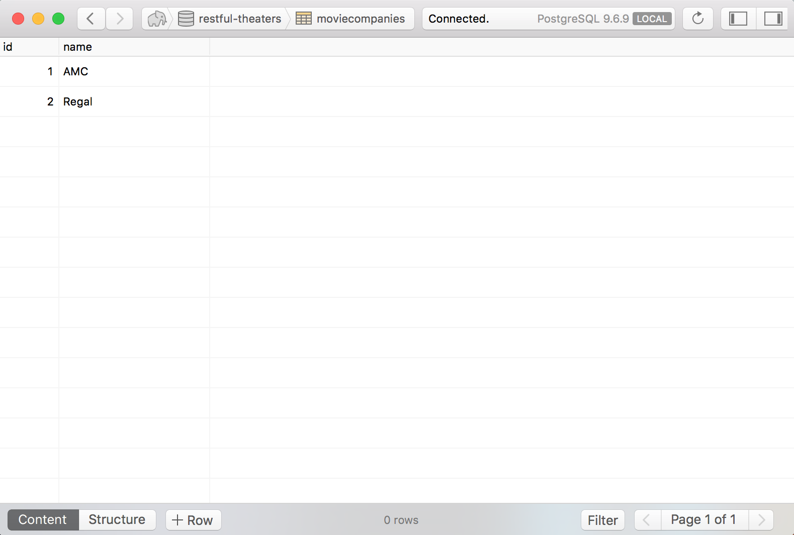
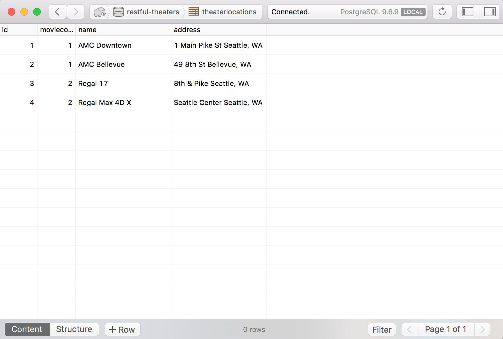

#  One-to-many Relationships 

## Resources
* [RESTful Spring Repositories](https://www.callicoder.com/spring-boot-jpa-hibernate-postgresql-restful-crud-api-example/)

You're provided with a server that models movie theater companies and theater
locations. There is a one-to-many relationship between a movie theater company
and the locations they operate. The `Regal` and `AMC` companies have locations
in many different cities (even multiple locations in the same city).

The server has the `MovieCompany` and `TheaterLocation` classes modeled and
annotated to integrate with the Java Persistence API (JPA). Your job is to
write code inside a `POST` route controller that creates a new
`TheaterLocation` and associates it with an existing `MovieCompany` using
a one-to-many relationship.

## Feature Tasks
* Set up a project with the provided starter code.
* Use Postico, another Postgres admin tool, or craft manual SQL to set up
  a database with the required properties.
* Verify that you can use the provided `Create Movie Company` HTML form,
  server, and route to create new `MovieCompany` instances in your database.
* Verify that you can use the provided `Add Theater Location` to hit the
  controller route configured to receive information for a new theater
  location.
* Vertify that you can send and access all the relevant information you'll need
  to use in this route (`company_id`, `theater name`, `theater address`).
* Use the `MovieCompany` and `TheaterLocation` repository interfaces to create
  new `TheaterLocations`, associate them with the proper `MovieCompany` and
  save them.
* Use Heroku command line tools to create a heroku app, deploy your solution
  and push up a database with pre-existing data in it. (remember that you have
  to go to heroku's website and specifically add the `Heroku Postgres` add-on).
  
```
 heroku create restful-theaters-<your_unique_name>
 git push heroku master

 DATABASE_URL=postgresql://localhost:5432
 heroku pg:push restful-theaters DATABASE_URL
 heroku pg:pull DATABASE_URL restful-theaters
```

## Database Structure
The structure (and example contents) of your database should look like the
following. Notice IDs have negative numbers. I've found this is a good way to
keep initial database content out of the way of Spring JPA auto-generated ids.






## Common Configuration Errors

### ClassNotFoundException: javax.xml.bind.JAXBException
Verify your project is configured to run Java 1.8 explicitly. `File > Project
Structure` then set `Project SDK` and `Project language level` dropdowns both
to 1.8.


### APPLICATION FAILED TO START
```
Description:
Failed to configure a DataSource: 'url' attribute is not specified
Reason: Failed to determine a suitable driver class
```

Remember to configure the database in the `application.properties` file.

**src/main/resources/application.properties**
```
## Spring DATASOURCE (DataSourceAutoConfiguration & DataSourceProperties)
spring.datasource.url=jdbc:postgresql://localhost:5432/restful-theaters
# spring.datasource.username= rajeevkumarsingh
# spring.datasource.password=

# The SQL dialect makes Hibernate generate better SQL for the chosen database
spring.jpa.properties.hibernate.dialect = org.hibernate.dialect.PostgreSQLDialect

# Hibernate ddl auto (create, create-drop, validate, update)
spring.jpa.hibernate.ddl-auto = update
```

### Database does not exist
Watch out because with this one you must scroll far up to see the real error.
You'll see other errors like `No identifier specified for entity: MovieCompany`
appear at the end of the log before you scroll further up and see the root
error:

```
org.postgresql.util.PSQLException: FATAL: database "restful-theaters" does not exist
```

Solve it by making sure Postgres is running and you've created a database
called `restful-theaters` as specified by the `application.properties` file.

### PgConnection.createClob() is not yet implemented.

Make sure to add this line to the `application.properties` config file. Sorry,
I'm being mean and intentionally not including it there by default. If you have
read these instructions, congratulations!

```
spring.jpa.properties.hibernate.jdbc.lob.non_contextual_creation=true
```

### Exception SpringEL expression: "company.name" (template: "index")
The template engine is having trouble accessing a property on your model class.
Make sure the properties on your model are `public`.

## Tests
No tests.

## Submission Instructions
* Work in a fork of this repository
* Work in a branch on your fork
* Write all of your code in a directory named `lab-` + `<your name>` **e.g.** `lab-susan`
* Open a pull request to this repository
* Submit on canvas a question and observation, how long you spent, and a link to
  your pull request
