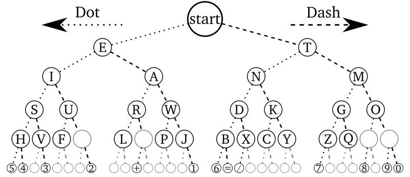

#  Morse Code Tree

Morse code stores letters, numbers and symbols in a tree. The short "bip bip
booop" sounds Morse Code sounds like represent traversing the tree left or
right. It's possible to program Morse Code as a tree and write a method that
accepts a string like "... --- ..." (a classic S.O.S. signal) and uses the
long dashes `-` and short dots `.` to traverse a tree and build a string of
letters.

Here's what the Morse Code tree looks like:



Think of `... --- ...` as traversing the tree

```
root -> left,left,left      stop on S
root -> right,right,right   stop on O
root -> left,left,left`     stop on S
```

You can spell "CAT" with `-.-. .- -`

```
root -> right,left,right,left stops on C
root -> left,right            stops on A
root -> right                 stops on T
```

Build a class using a tree that represents Morse Code. Instead of using `left`
and `right` nodes to represent smaller or larger values use them to represent
short dots and long dash morse code blips.

* A short blip `.` moves left
* A long blip `-` moves right

Add a method to your tree `decode()` that accepts a String like `"... --- ..."`
and returns "SOS" the decoded symbols.

You'll have to manually create the Morse Code symbol tree with the nodes filled
in with the right values within the class once you've created it.
