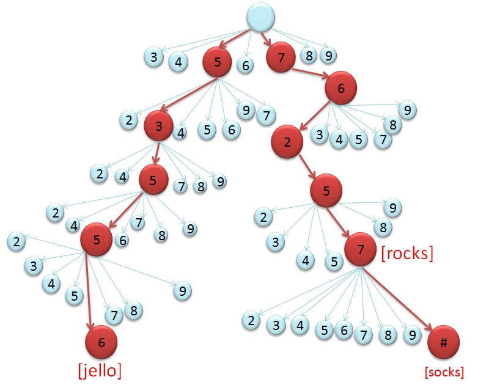
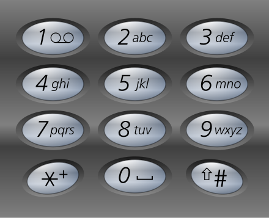

#  Build A T9 Trie

## Resources
* [Wikipedia: Trie](https://en.wikipedia.org/wiki/Trie)
* [Wikipedia: T9 Predictive Text](https://en.wikipedia.org/wiki/T9_(predictive_text))

Remember flip phones? You'd press numbers to text. It's possible to represent
typing numbers and turning them into possible words using a tree structure.

This Tree structure is different than other Tree structures we've seen before
because each node can have more than 2 branches branching off it.

Here's what part of a T9 Trie might look like:



**Fun Fact:** T9 stands for "Text on 9 keys."

The `root` node of the T9 Trie has one branch for every digit on the phone's
keypad. Each node stores a list of possible words, populated by a dictionary.
If a person hit the numbers `53556` they would end up on a node with a list
of words including "jello".

Since there's only ten digits `0-9` and there's 26 letters and more symbols
each number key is associated with more than one character. Here's what Nokia
uses for their T9 system:



Your `T9Node` class should be structured something like this. The List of
Strings stores all the possible words that can be spelled be pressing the
numbers that got you to this node. The Map is used to store Key,Value pairs
so inputing the next Integer obtains a reference to the next `T9Node`.

```java
class T9Node {
  List<String> possibleWords;
  Map<Integer, T9Node> branches;
}
```

You'll need to complete this challenge in two steps:
1. Build a T9 tree from a dictionary.
2. Accept user input in the form of a list of Integers, traverse the tree
   according to the input and return a list of possible words.

Download a [Scrabble dictionary](https://raw.githubusercontent.com/zeisler/scrabble/master/db/dictionary.csv)
and use it to populate the dictionary. Iterate over every word in the dictionary,
map each letter to it's corresponding keypad number, traverse the tree according
to the list of numbers for a word, and store the word in the list at that node.

Write a method `text()` that accepts a String like `"76257"` and returns a list
of possible words, in this class it should include the word `"rocks"`.

## Feature Tasks
* Create a class called `T9Tree`
* Create a default constructor that loads a default dictionary file
* Create a second constructor that accepts a list of Strings to use
  as a custom dictionary
* Include a private method called `charToDigit()`
  * It should accept a single character and return an integer represent the
    digit corresponding to that letter on the phone keypad.
* Include a private method called `buildTree()`
* Call `buildTree()` in the constructor when any T9Tree is created
  * Use `Scanner` to read the scrabble dictionary from file to extract a list
    of words
  * Iterate over the list of words
  * Iterate over each letter in each word
  * Create a root node for the tree
  * Create a new node for each digit corresponding to each character in each
    word
  * Traverse the tree according to each character
  * Add the complete word at the node you land on when you finish traversing
    the tree according to each character.
  * Use helper methods to encapsulate different major steps of building up the
    tree
* Add methods to interact with the `T9Tree`
  * `digitsToWords()` 
    * accepts a string representing a sequence of digits
    * returns a list of words at the node reached by traversing the tree
      according to the digits.

## Testing
* Give the `T9Tree` a small dictionary and make sure it builds the tree
  correctly.
* Test the `charToDigit()` for all letters in the alphabet
* Test the `digitsToWords()` method for a single letter word
* Test the `digitsToWords()` method for a few-letter word
* Test the `digitsToWords()` method for a many-letter word
* Test the `digitsToWords()` method for a character sequence that starts with `0`
* Test the `digitsToWords()` method to make sure it returns an empty list for
  empty sequences
* Test the `digitsToWords()` method giving it a character sequence for a word
  that doesn't exist


## Documentation
Write comments for each method clearly explaining the parameters,
functionality, and return value.

## Stretch Goals
* Add a `.wordToCode()` method that returns a character sequence for a given
  word.
* Expose an `.addWord()` method so people can add words after the tree is built.

## Submission Instructions
* Work in a fork of this repository
* Work in a branch on your fork
* Write all of your code in a directory named `lab-` + `<your name>` **e.g.** `lab-susan`
* Open a pull request to this repository
* Submit on canvas a question and observation, how long you spent, and a link to
  your pull request
