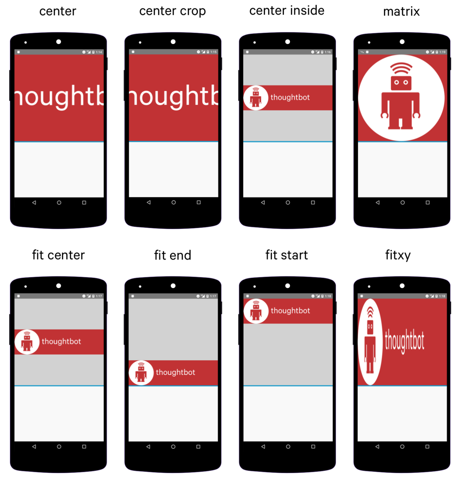
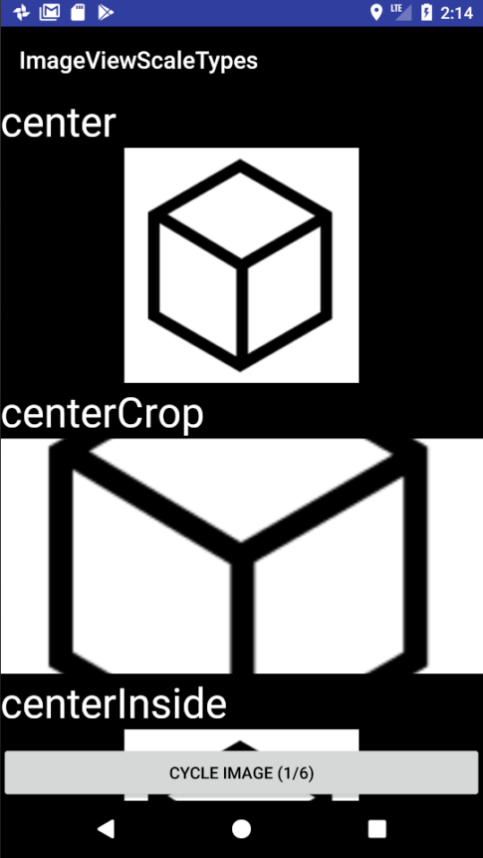
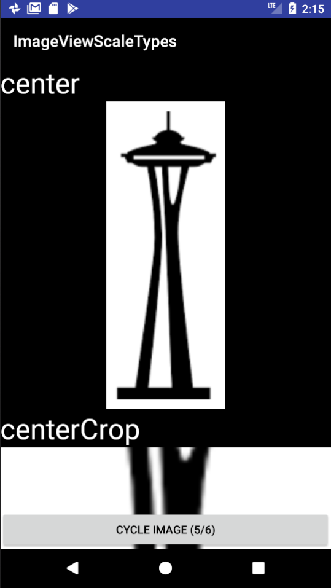
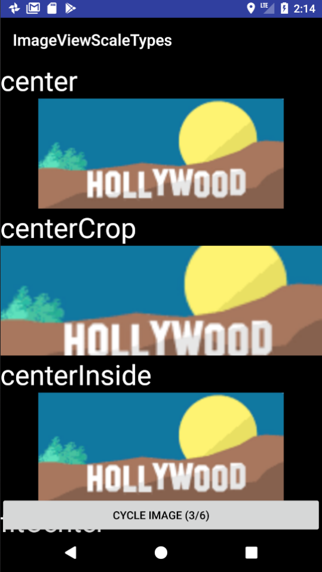

#  Async Tasks and Downloading Images

# Reading
* Read Big Nerd Ranch
* **HTTP and Background Tasks** (pages 473-498)

# References
* Camera Basics: https://developer.android.com/training/camera/photobasics.html
* ViewHolder: https://developer.android.com/training/improving-layouts/smooth-scrolling.html
* RecyclerView: https://developer.android.com/guide/topics/ui/layout/recyclerview.html

This class is all about creating images, picking images, and displaying images.
We'll use the camera, the gallery, and get images from the internet. Our
ultimate goal is to display images in a `ListView` so we can scroll through
them smoothly and efficiently.

### Topics  
* Get Bitmap from camera
* Display Bitmap in ImageView
* Save picture to Gallery
* Pick image from Gallery
* Display images in list
* Get image from URL
* Cache URL requests
* Always inflate a new view
* Use the convert view to avoid always inflating
* Build a ViewHolder and setTag to avoid having to look up ImageView each time
* Cache Bitmaps inside DownloadImageTask
* Use RecyclerView to optimize images in ListViews

### ImageView ScaleTypes
This app shows off all the different possible values for the `scaleType`
attribute on an `ImageView`.

Notice that setting `adjustViewBounds` to `true` eliminates extra padding
that appears above or below images for certain scale types. (Note: the app
actually restarts when `adjustViewBounds` is toggled to `false` because it
must reset the `ImageView` to a clean slate.)

For a quick visual reference refer to this webpage which shows off the
scale types similarly: <https://robots.thoughtbot.com/android-imageview-scaletype-a-visual-guide>

And, here's a screenshot of that website:




Here's how the Android docs describe the scale types: <https://developer.android.com/reference/android/widget/ImageView.ScaleType.html>

<!-- Copied from Android docs -->
<table id="enumconstants" class="responsive constants">
  <tbody><tr><th colspan="2"><h3>Enum values</h3></th></tr>


  <tr class="api apilevel-1">
    <td><code><a href="https://developer.android.com/reference/android/widget/ImageView.ScaleType.html">ImageView.ScaleType</a></code>&nbsp;</td>
    <td width="100%">
      <code>CENTER</code>
      <p>Center the image in the view, but perform no scaling.&nbsp;


</p>
    </td>
  </tr>


  <tr class="api apilevel-1">
    <td><code><a href="https://developer.android.com/reference/android/widget/ImageView.ScaleType.html">ImageView.ScaleType</a></code>&nbsp;</td>
    <td width="100%">
      <code>CENTER_CROP</code>
      <p>Scale the image uniformly (maintain the image's aspect ratio) so
 that both dimensions (width and height) of the image will be equal
 to or larger than the corresponding dimension of the view
 (minus padding).&nbsp;


</p>
    </td>
  </tr>


  <tr class="api apilevel-1">
    <td><code><a href="https://developer.android.com/reference/android/widget/ImageView.ScaleType.html">ImageView.ScaleType</a></code>&nbsp;</td>
    <td width="100%">
      <code>CENTER_INSIDE</code>
      <p>Scale the image uniformly (maintain the image's aspect ratio) so
 that both dimensions (width and height) of the image will be equal
 to or less than the corresponding dimension of the view
 (minus padding).&nbsp;


</p>
    </td>
  </tr>


  <tr class="api apilevel-1">
    <td><code><a href="https://developer.android.com/reference/android/widget/ImageView.ScaleType.html">ImageView.ScaleType</a></code>&nbsp;</td>
    <td width="100%">
      <code>FIT_CENTER</code>
      <p>Scale the image using <code><a href="https://developer.android.com/reference/android/graphics/Matrix.ScaleToFit.html#CENTER">CENTER</a></code>.&nbsp;


</p>
    </td>
  </tr>


  <tr class="api apilevel-1">
    <td><code><a href="https://developer.android.com/reference/android/widget/ImageView.ScaleType.html">ImageView.ScaleType</a></code>&nbsp;</td>
    <td width="100%">
      <code>FIT_END</code>
      <p>Scale the image using <code><a href="https://developer.android.com/reference/android/graphics/Matrix.ScaleToFit.html#END">END</a></code>.&nbsp;


</p>
    </td>
  </tr>


  <tr class="api apilevel-1">
    <td><code><a href="https://developer.android.com/reference/android/widget/ImageView.ScaleType.html">ImageView.ScaleType</a></code>&nbsp;</td>
    <td width="100%">
      <code>FIT_START</code>
      <p>Scale the image using <code><a href="https://developer.android.com/reference/android/graphics/Matrix.ScaleToFit.html#START">START</a></code>.&nbsp;


</p>
    </td>
  </tr>


  <tr class="api apilevel-1">
    <td><code><a href="https://developer.android.com/reference/android/widget/ImageView.ScaleType.html">ImageView.ScaleType</a></code>&nbsp;</td>
    <td width="100%">
      <code>FIT_XY</code>
      <p>Scale the image using <code><a href="https://developer.android.com/reference/android/graphics/Matrix.ScaleToFit.html#FILL">FILL</a></code>.&nbsp;


</p>
    </td>
  </tr>


  <tr class="api apilevel-1">
    <td><code><a href="https://developer.android.com/reference/android/widget/ImageView.ScaleType.html">ImageView.ScaleType</a></code>&nbsp;</td>
    <td width="100%">
      <code>MATRIX</code>
      <p>Scale using the image matrix when drawing.&nbsp;


</p>
    </td>
  </tr>
<!-- ========== METHOD SUMMARY =========== -->
</tbody></table>

Here's what the app looks like





### Download Image Task
```java
public class DownloadImageTask extends AsyncTask<Void, Void, Bitmap> {
    private static Map<String, Bitmap> cache = new HashMap<>();

    private Context mContext;
    private String mUrl;
    private ImageView mView;

    public DownloadImageTask(Context context, String url, ImageView view) {
        mContext = context;
        mUrl = url;
        mView = view;
    }

    @Override
    protected Bitmap doInBackground(Void... voids) {
        try {
            if (cache.containsKey(mUrl)) {
                return cache.get(mUrl);
            }
            InputStream stream = new URL(mUrl).openConnection().getInputStream();
            Bitmap bitmap = BitmapFactory.decodeStream(stream);

            Thread.sleep(1500);
            cache.put(mUrl, bitmap);

            return bitmap;
        } catch (IOException e) {
            return null;
        } catch (InterruptedException e) {

        }

        return null;
    }

    @Override
    protected void onPostExecute(Bitmap bitmap) {
        if (bitmap != null) {
            super.onPostExecute(bitmap);
            mView.setImageBitmap(bitmap);
        }
    }
}
```
