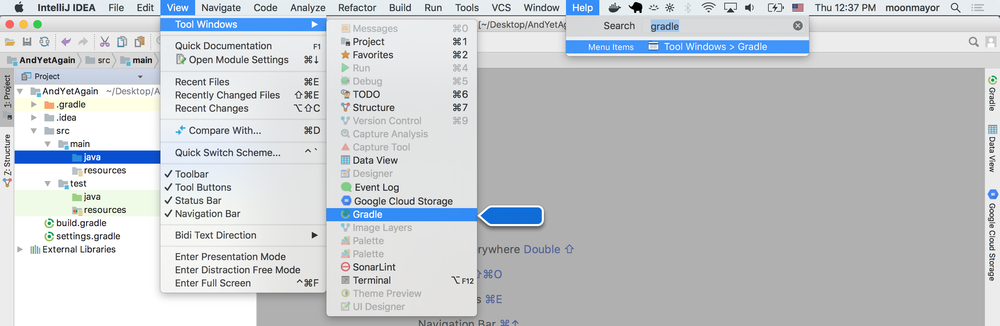
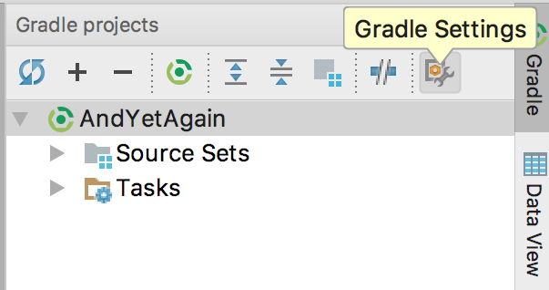
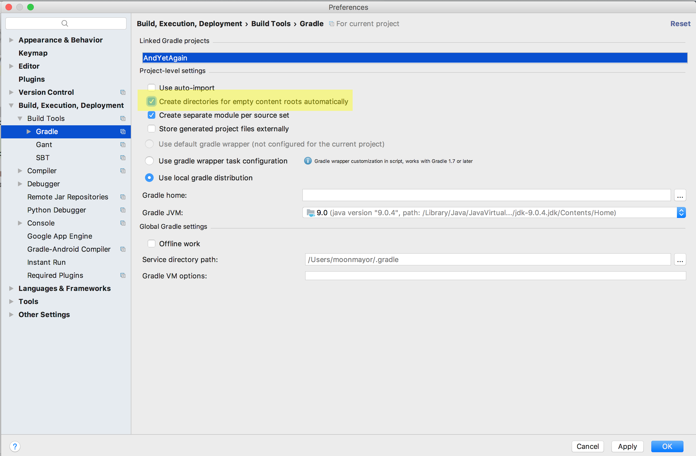
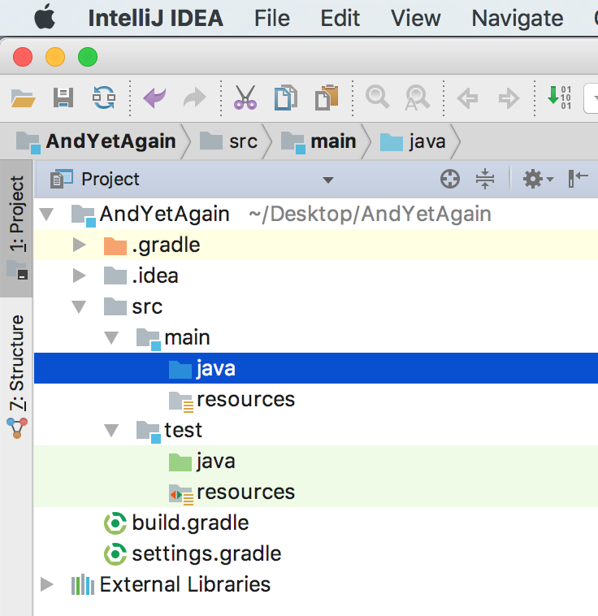
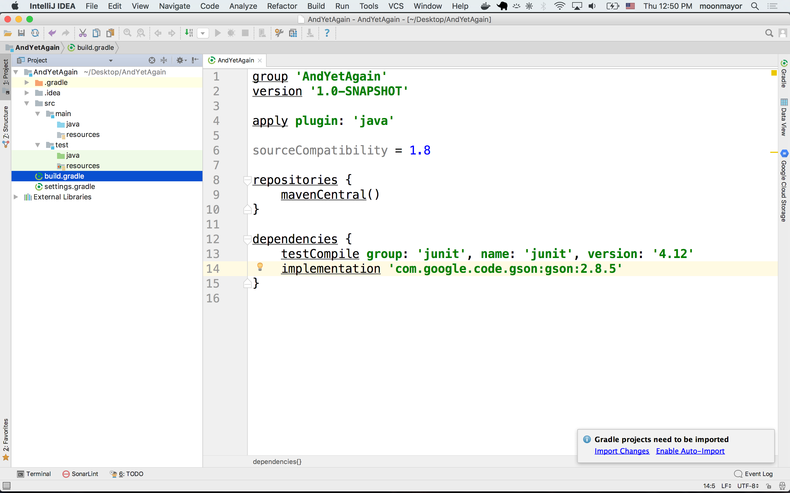
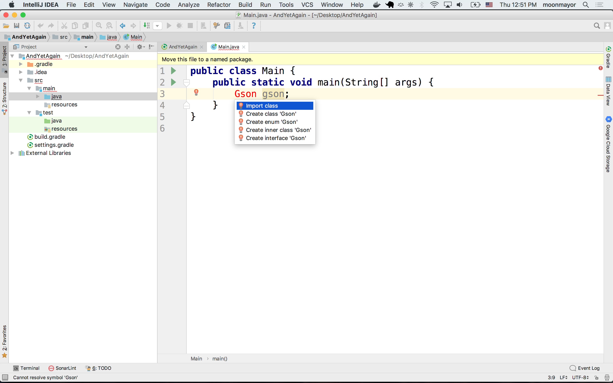
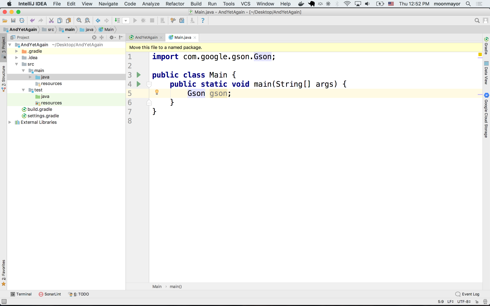

# Configure JDK 9

## Context
Java changed how the version string is presented.

* [Java New Version-String Scheme proposal](http://openjdk.java.net/jeps/223)
* [Gradle issue](https://github.com/gradle/gradle/pull/4759)
* [Maven Standard Directory Structure](https://maven.apache.org/guides/introduction/introduction-to-the-standard-directory-layout.html)

# Solution

## Download and Install JDK 9
Get it here: https://s3-us-west-2.amazonaws.com/java-401-d1/jdk-9.0.4_osx-x64_bin.dmg

## Create New Project
* Create new Intellij Project
* Choose Gradle
* Project SDK: Select New- JDK


## Find Java Virtual Machine Home Directory
* Click dropdown- navigate to Java Virtual Machines
* Then select jdk -9
* Then expand jdk 9
*  Click to expand ‘contents’
* Select ‘Home’
* Press Open


## Set Project SDK to JDK 9
* Select  java 9 from right side drop down menu
* Select Next


## Enter Project Name as GroupID and ArtifactID
* Enter project name for GroupID
* Enter project name for ArtifactID
* Press next


## Leave Most Gradle Settings as Default
* Leave everything to default
* Gradle JVM: Choose 9.0.4 from dropdown
* Press Next


## Verify Project Location and Finish
* Verify project location is where you want it to be
* Click Finish

## Choose Import Gradle Changes
* A balloon menu will pop up in the bottom right corner of your screen.
* Select "import changes"


## Accessing Gradle Settings
* Search for "gradle" in the help menu to find the gradle tool window toggle
* Click the Gradle button on the right side bar to toggle the Gradle panel
* Choose "Gradle Settings" to access Gradle settings




## Configure Gradle to Create Directories Automatically
* Open the Gradle settings from the Gradle site bar
* Enable the checkbox for "Create directories for empty content roots
  automatically"
* Look at your project structure in the left bar and notice it has built out
  a project structure with `src`, `main`, `test`, `java` and `resource`
  directories for you. This is called the [Maven Standard Directory Structure](https://maven.apache.org/guides/introduction/introduction-to-the-standard-directory-layout.html)

)


## Add Gson as a Project Dependency
* Open your `build.gradle` file
* Add the following as a project dependency. Gradle will automatically download
  the Gson JAR and configure it in your project.
* Be sure to select "import changes" when the balloon menu pops up because
  IntelliJ detected changes to the Gradle file.
* Create a class under `src/main/java/Main.java`
* Add a main method and declare an object `Gson gson;`.
* Use IntelliJ's auto-import to add an import statement for Gson into the
  `Main.java` file.
* If IntelliJ doesn't offer an option to "import class" then make sure you've
  selected "import changes" for Gradle and rebuilt the project.

```
dependencies {
    implementation 'com.google.code.gson:gson:2.8.5'
}
```




