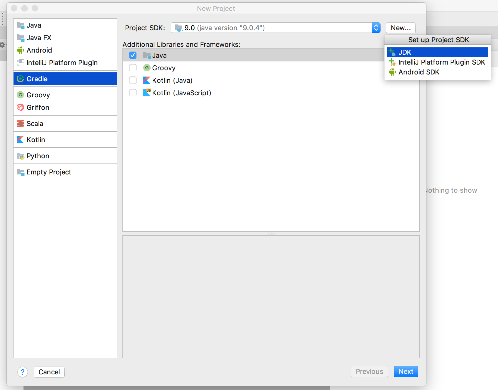
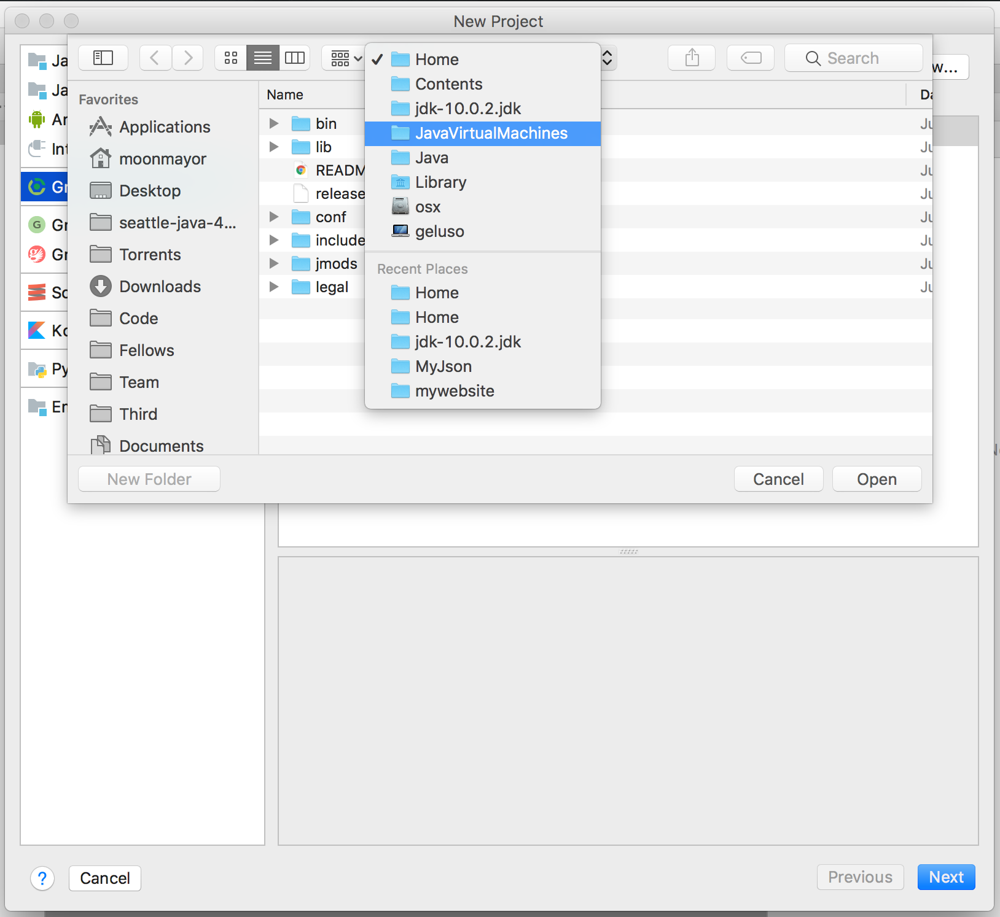
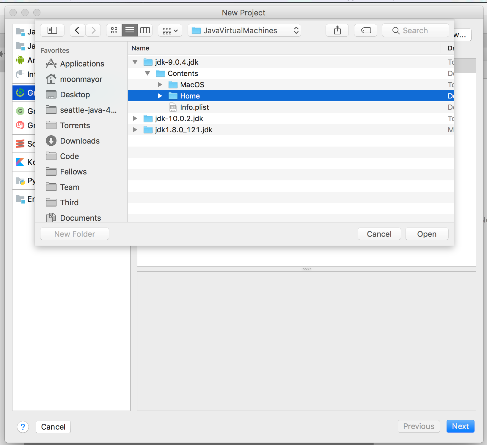
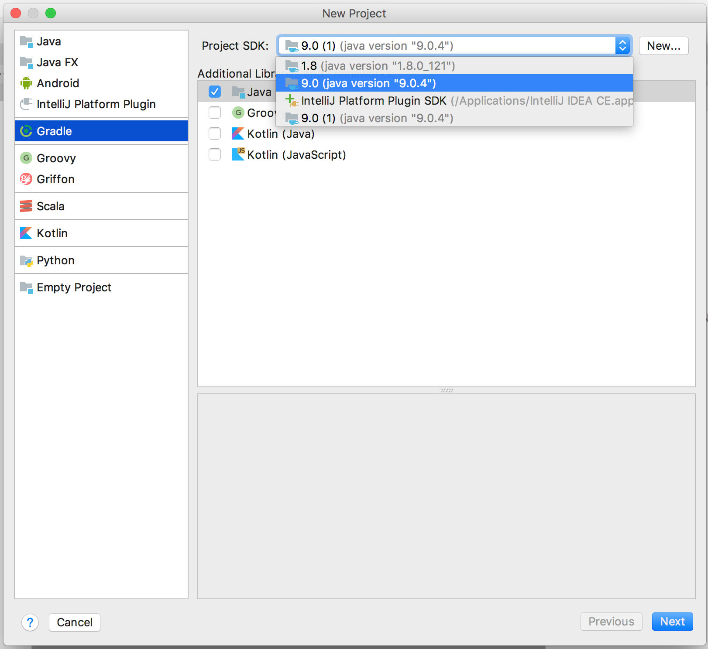
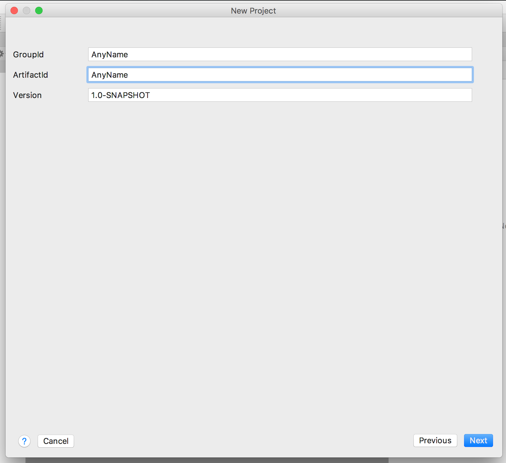
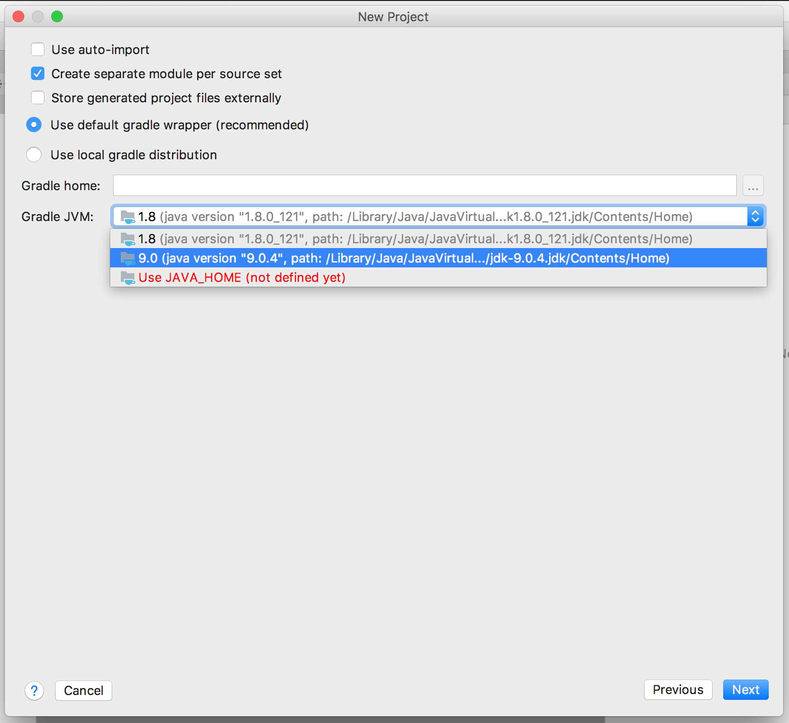

# Configure JDK 9

## Download and Install JDK 9
Get it here: https://s3-us-west-2.amazonaws.com/java-401-d1/jdk-9.0.4_osx-x64_bin.dmg

## Create New Project
* Create new Intellij Project
* Choose Gradle
* Project SDK: Select New- JDK

## Find Java Virtual Machine Home Directory
* Click dropdown- navigate to Java Virtual Machines
* Then select jdk -9
* Then expand jdk 9
*  Click to expand ‘contents’
* Select ‘Home’
* Press Open

## Set Project SDK to JDK 9
* Select  java 9 from right side drop down menu
* Select Next

## Enter Project Name as GroupID and ArtifactID
* Enter project name for GroupID
* Enter project name for ArtifactID
* Press next

## Leave Most Gradle Settings as Default
* Leave everything to default
* Gradle JVM: Choose 1.9 from dropdown
* Press Next

## Verify Project Location and Finish
* Verify project location is where you want it to be
* Click Finish
